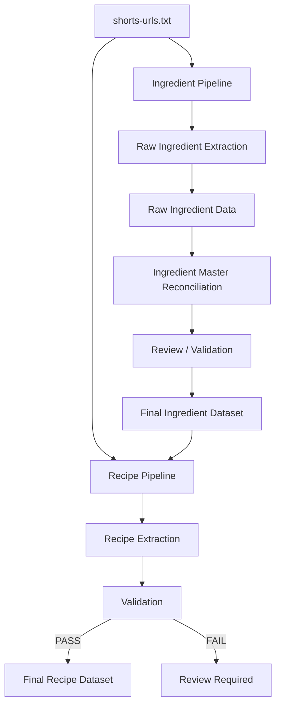

# 목적

YouTube Shorts 기반의 비정형 요리 데이터를 Gemini API로 분석하여 WhipUp의 최종 Ingredient Dataset과 Recipe Dataset을 생성한다.

이 문서는 **AI로 Dataset을 생성하는 과정**을 정의한다. 확정된 Dataset을 PostgreSQL에 반영하는 과정은 `data-import.md`에서 관리한다.

```plain text
YouTube Shorts
    ↓
AI Data Pipeline
    ↓
Validated Dataset
    ↓
Bulk Import
    ↓
PostgreSQL
```

# 기본 원칙

- 파이프라인은 Ingredient Pipeline과 Recipe Pipeline으로 분리한다.
- 입력 영상은 URL 문자열이 아니라 YouTube `videoId`를 실질 식별자로 사용한다.
- 동일 영상에 대한 불필요한 Gemini Video 호출을 피하기 위해 중간 결과를 캐시한다.
- AI가 영상에서 확인할 수 없는 내용을 추측하여 채우지 않는다.
- Raw Extraction과 Canonicalization/Mapping을 분리한다.
- Recipe Pipeline은 확정된 Ingredient Master를 기준으로만 매핑한다.
- Recipe Pipeline은 새로운 Ingredient를 임의로 생성하거나 Ingredient Master를 수정하지 않는다.
- AI 결과를 곧바로 서비스 데이터로 사용하지 않고 validation/review 단계를 거친다.
- `data/`는 최종 확정 Dataset, `tools/data-pipeline/`은 Dataset 생성 과정으로 역할을 분리한다.

# 전체 흐름



# 입력

초기에는 Ingredient Pipeline과 Recipe Pipeline이 동일한 입력 파일을 공유한다.

```plain text
tools/data-pipeline/input/shorts-urls.txt
```

예:

```plain text
https://youtu.be/aaa
https://youtu.be/bbb
https://www.youtube.com/watch?v=ccc
```

입력 URL은 실행 시 `videoId`로 정규화한다. 같은 영상의 URL 형식이나 query parameter가 달라도 동일 `videoId`이면 같은 영상으로 취급한다.

# 1. Ingredient Pipeline

## 1.1 Raw Ingredient Extraction

각 영상을 Gemini Video 입력으로 분석하여 영상에서 실제로 확인되는 재료 표현을 추출한다.

이 단계에서는 기존 Ingredient Master를 Gemini에게 전달하지 않는다. 목적은 정규화가 아니라 **영상의 원본 표현을 보존하는 것**이다.

규칙:

- 영상에서 직접 확인되는 재료만 추출한다.
- 재료를 추측하지 않는다.
- 원본 표현을 최대한 보존한다.
- canonical Ingredient로 정규화하지 않는다.
- 양/단위를 확인할 수 없으면 `null`로 둔다.
- `sourceUrl`과 `videoId`는 AI 생성값에 의존하지 않고 코드에서 관리한다.

개념적 결과 예:

```json
{
  "videoId": "3mPwNQ-WiNs",
  "sourceUrl": "https://youtu.be/3mPwNQ-WiNs",
  "ingredients": [
    {
      "rawText": "진간장 2스푼",
      "displayName": "진간장",
      "amount": "2",
      "unit": "스푼"
    },
    {
      "rawText": "우삼겹",
      "displayName": "우삼겹",
      "amount": null,
      "unit": null
    }
  ]
}
```

## 1.2 Raw Result Cache

영상별 Raw Extraction 결과를 저장한다.

```plain text
tools/data-pipeline/ingredient/raw/{videoId}.json
```

현재 Pipeline 기준으로 이미 정상 처리된 결과가 있으면 Gemini Video API를 다시 호출하지 않고 기존 결과를 재사용한다.

## 1.3 Ingredient Master Reconciliation

모든 Raw Ingredient 표현을 취합한 뒤 기존 Ingredient Master와 비교하여 canonical Ingredient, Ingredient Form, Category 변경 후보를 만든다.

```plain text
Raw Ingredient Expressions
+
Existing Ingredient Master
    ↓
Gemini Reconciliation
    ↓
Master Change Proposal
```

예시 후보:

```json
{
  "existingMappings": [
    {
      "raw": "진간장",
      "ingredient": "진간장"
    }
  ],
  "newIngredients": [
    {
      "canonicalName": "우삼겹"
    }
  ],
  "newForms": [
    {
      "canonicalIngredient": "삼겹살",
      "displayName": "대패삼겹살",
      "formType": "THIN_SLICE"
    }
  ],
  "unresolved": []
}
```

AI의 결과는 Master 변경 **제안**으로 취급한다. 최종 반영 전 validation/review를 거친다.

최종 Ingredient Dataset은 기존 데이터 설계에 따라 다음 파일로 관리한다.

```plain text
data/ingredients.csv
data/ingredient-categories.csv
data/ingredient-category-mappings.csv
data/ingredient-forms.csv
```

# 2. Recipe Pipeline

Recipe Pipeline은 영상과 **확정된 Ingredient Master**를 함께 사용하여 Recipe Dataset을 생성한다.

```plain text
YouTube Video
+
Final Ingredient Master
    ↓
Gemini Recipe Extraction
    ↓
Recipe JSON
    ↓
Validation
```

## 2.1 Ingredient Mapping Rule

Recipe Pipeline은 Ingredient Master를 읽을 수 있지만 수정할 수 없다.

영상의 재료를 기존 Ingredient/Form에 매핑할 수 없는 경우 새로운 Ingredient를 임의 생성하지 않고 `UNMAPPED`로 표시한다.

```json
{
  "rawText": "치킨파우더 1스푼",
  "mappingStatus": "UNMAPPED"
}
```

`UNMAPPED`가 존재하는 Recipe는 최종 Dataset으로 바로 이동하지 않고 review 대상으로 분류한다. 필요한 경우 Ingredient Master를 별도로 갱신한 뒤 해당 Recipe를 재처리한다.

## 2.2 Validation

Recipe 생성 결과는 최소한 다음 조건을 검증한다.

- Recipe 식별 key가 존재한다.
- 이름과 Shorts reference가 존재한다.
- Ingredient가 1개 이상 존재한다.
- 모든 Ingredient가 canonical Ingredient에 매핑되어 있다.
- Ingredient Form이 지정된 경우 canonical Ingredient와 일치한다.
- 실제 영상 표현을 위한 display/raw 값이 보존되어 있다.
- 조리 Step이 1개 이상 존재한다.
- Ingredient/Step 순서를 보존한다.

Validation 결과:

```plain text
PASS
  → data/recipes/

FAIL / UNMAPPED
  → review/
```

# 3. 캐시와 재처리

단순히 결과 파일 존재 여부만으로 영구 skip하지 않는다. Prompt, 모델, 파이프라인 로직이 변경될 수 있으므로 결과에 Pipeline metadata를 기록한다.

개념 예:

```json
{
  "pipeline": {
    "type": "RECIPE_EXTRACTION",
    "version": 1,
    "model": "gemini-3.8-flash",
    "ingredientMasterHash": "18af32..."
  }
}
```

처리 기준:

```plain text
결과 없음
→ 처리

결과 있음 + 현재 Pipeline 기준과 동일
→ SKIP / 기존 결과 재사용

결과 있음 + Pipeline Version 변경
→ 재처리

Recipe 결과 있음 + Ingredient Master Hash 변경
→ stale 처리 후 재처리 대상
```

Ingredient Master Hash는 최종 Ingredient Dataset의 내용이 변경되었는지를 감지하기 위한 값이다. 구체적인 hash 계산 방식은 구현 시 확정한다.

# 4. 처리 상태와 실패 격리

영상별 작업 상태는 다음 상태를 기준으로 관리한다.

- `PENDING`
- `PROCESSING`
- `COMPLETED`
- `FAILED`
- `REVIEW_REQUIRED`

한 영상의 실패가 전체 Batch를 중단시키지 않는다. 성공한 영상 결과는 보존하고 실패한 영상만 재시도할 수 있어야 한다.

개념 예:

```json
{
  "videoId": "abc",
  "status": "FAILED",
  "attempts": 3,
  "error": "Gemini API timeout"
}
```

# 5. Repository 구조

개념적인 Repository 구조는 다음을 기준으로 한다.

```plain text
whipup/
├── app/
├── backend/
├── data/
│   ├── ingredients.csv
│   ├── ingredient-categories.csv
│   ├── ingredient-category-mappings.csv
│   ├── ingredient-forms.csv
│   └── recipes/
├── docs/
└── tools/
    └── data-pipeline/
        ├── input/
        │   └── shorts-urls.txt
        ├── ingredient/
        │   ├── raw/
        │   ├── review/
        │   └── manifest.json
        ├── recipe/
        │   ├── raw/
        │   ├── review/
        │   └── manifest.json
        ├── src/
        │   ├── ingredients.py
        │   ├── recipes.py
        │   ├── gemini_client.py
        │   ├── youtube.py
        │   └── cache.py
        ├── requirements.txt
        └── README.md
```

`data/`에는 서비스에 사용할 최종 확정 Dataset만 둔다. AI 응답, 중간 결과, 실패 정보, review 대상 등은 `tools/data-pipeline/`에서 관리한다.

파이프라인 코드는 서비스 런타임 코드와 분리하여 `tools/data-pipeline/` 아래에 둔다. `backend/`는 사용자 요청을 처리하는 서비스 코드의 영역이며, Dataset 생성용 Gemini 파이프라인을 포함하지 않는다. `data/` 역시 코드 저장소가 아니라 최종 Dataset의 영역으로 유지한다.

초기 구현에서는 과도하게 패키지를 세분화하지 않고 다음 역할을 기준으로 시작한다.

- `ingredients.py`: Ingredient Pipeline 실행 진입점
- `recipes.py`: Recipe Pipeline 실행 진입점
- `gemini_client.py`: Gemini API 호출 공통 로직
- `youtube.py`: YouTube URL 정규화 및 `videoId` 추출
- `cache.py`: 처리 여부, Pipeline metadata, 캐시 유효성 판단

`ingredients.py`와 `recipes.py`는 orchestration 중심으로 유지하고 Gemini 호출, YouTube URL 처리, 캐시 판단 같은 공통 책임은 별도 모듈로 분리한다. 파이프라인 규모가 실제로 커질 때만 `ingredient/`, `recipe/`, `common/` 등의 Python package로 추가 분리한다.

# 6. 비용 및 토큰 절감 원칙

1. 동일 영상의 정상 처리 결과가 유효하면 Gemini Video API를 다시 호출하지 않는다.
2. URL 문자열이 아니라 `videoId` 기준으로 중복을 제거한다.
3. Ingredient Raw Extraction에는 Ingredient Master를 전달하지 않는다.
4. Recipe Extraction에는 매핑에 필요한 Ingredient Master를 전달한다.
5. Pipeline/Prompt/Model/Master가 동일하면 기존 결과를 재사용한다.
6. Batch 일부가 실패하면 실패한 영상만 재시도한다.

# 7. 실행 인터페이스 방향

사용자 관점에서는 Ingredient와 Recipe 작업을 분리한다.

```bash
python ingredients.py
python recipes.py
```

실제 파일명과 CLI 구조는 구현 시 확정한다. Ingredient Pipeline 내부에서는 Raw Extraction과 Master Reconciliation을 단계적으로 수행한다.

# 8. 기존 데이터 Import와의 경계

AI Data Pipeline의 책임은 **Validated Dataset 생성까지**이다.

```plain text
AI Data Pipeline
    ↓
Validated Dataset
    ↓
Data Import
    ↓
PostgreSQL
```

DB 반영, upsert, import failure 정책 등은 `data-import.md`의 규칙을 따른다.

# 미확정 사항

다음 항목은 구현 전에 추가 확정한다.

1. Ingredient Master 변경 제안을 사람이 매번 승인할지, 일부를 자동 반영할지
2. `raw/`, `review/`, manifest 등 중간 산출물을 Git에 커밋할지
3. Recipe Extraction에 전체 Ingredient Master를 전달할지, 필요한 형태로 압축하여 전달할지
4. Pipeline Version 및 Ingredient Master Hash의 구체적인 생성 규칙
5. Gemini Structured Output의 최종 JSON Schema
6. 재시도 횟수와 retry/backoff 정책
