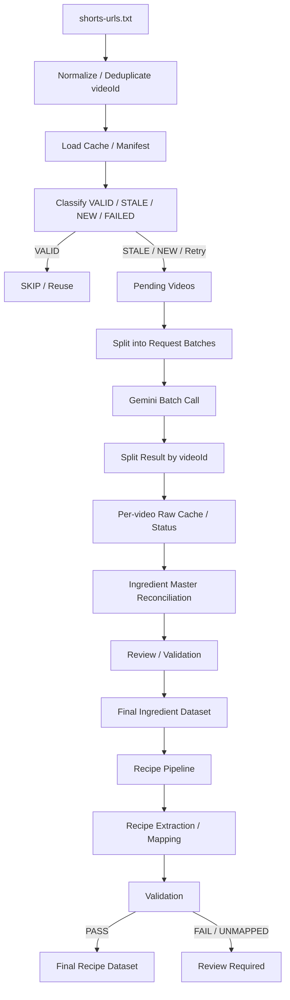

# 목적

YouTube Shorts 기반의 비정형 요리 데이터를 Gemini API로 분석하여 WhipUp의 최종 Ingredient Dataset과 Recipe Dataset을 생성한다.

이 문서는 **AI로 Dataset을 생성하는 과정**을 정의한다. 확정된 Dataset을 PostgreSQL에 반영하는 과정은 `data-import.md`에서 관리한다.

```plain text
YouTube Shorts
    ↓
AI Data Pipeline
    ↓
Validated Dataset
    ↓
Bulk Import
    ↓
PostgreSQL
```

# 기본 원칙

- 파이프라인은 Ingredient Pipeline과 Recipe Pipeline으로 분리한다.
- 입력 영상은 URL 문자열이 아니라 YouTube `videoId`를 실질 식별자로 사용한다.
- 동일 영상에 대한 불필요한 Gemini Video 호출을 피하기 위해 중간 결과를 캐시한다.
- Gemini 호출 전에 전체 입력의 `videoId`를 먼저 정규화/중복 제거하고 cache/manifest를 일괄 확인하여 실제 처리 대상만 추린다.
- 처리 대상 영상은 API 제한과 context 크기 범위 안에서 가능한 만큼 묶어 batch 요청하여 request quota 사용량을 줄인다.
- Gemini 요청은 batch 단위로 하더라도 결과와 상태는 반드시 `videoId` 단위로 분리해 저장한다.
- AI가 영상에서 확인할 수 없는 내용을 추측하여 채우지 않는다.
- Raw Extraction과 Canonicalization/Mapping을 분리한다.
- Recipe Pipeline은 확정된 Ingredient Master를 기준으로만 매핑한다.
- Recipe Pipeline은 새로운 Ingredient를 임의로 생성하거나 Ingredient Master를 수정하지 않는다.
- AI 결과를 곧바로 서비스 데이터로 사용하지 않고 validation/review 단계를 거친다.
- `data/`는 최종 확정 Dataset, `tools/data-pipeline/`은 Dataset 생성 과정으로 역할을 분리한다.

# 전체 흐름


```mermaid
graph TD
    A["shorts-urls.txt"] --> B["Normalize / Deduplicate videoId"]
    B --> C["Load Cache / Manifest"]
    C --> D["Classify VALID / STALE / NEW / FAILED"]
    D -->|VALID| E["SKIP / Reuse"]
    D -->|STALE / NEW / Retry| F["Pending Videos"]
    F --> G["Split into Request Batches"]
    G --> H["Gemini Batch Call"]
    H --> I["Split Result by videoId"]
    I --> J["Per-video Raw Cache / Status"]
    J --> K["Ingredient Master Reconciliation"]
    K --> L["Review / Validation"]
    L --> M["Final Ingredient Dataset"]
    M --> N["Recipe Pipeline"]
    N --> O["Recipe Extraction / Mapping"]
    O --> P["Validation"]
    P -->|PASS| Q["Final Recipe Dataset"]
    P -->|FAIL / UNMAPPED| R["Review Required"]
```

# 입력

초기에는 Ingredient Pipeline과 Recipe Pipeline이 동일한 입력 파일을 공유한다.

```plain text
tools/data-pipeline/input/shorts-urls.txt
```

예:

```plain text
https://youtu.be/aaa
https://youtu.be/bbb
https://www.youtube.com/watch?v=ccc
```

입력 URL은 실행 시 `videoId`로 정규화한다. 같은 영상의 URL 형식이나 query parameter가 달라도 동일 `videoId`이면 같은 영상으로 취급한다.

# 1. Ingredient Pipeline

## 1.1 Raw Ingredient Extraction

전체 입력의 처리 상태를 먼저 확인한 뒤, 아직 처리되지 않았거나 재처리가 필요한 영상만 Gemini Video 입력으로 분석한다. 처리 대상이 여러 개라면 API가 허용하는 범위에서 하나의 request batch로 묶어 영상에서 실제로 확인되는 재료 표현을 추출한다.

이 단계에서는 기존 Ingredient Master를 Gemini에게 전달하지 않는다. 목적은 정규화가 아니라 **영상의 원본 표현을 보존하는 것**이다.

규칙:

- 영상에서 직접 확인되는 재료만 추출한다.
- 재료를 추측하지 않는다.
- 원본 표현을 최대한 보존한다.
- canonical Ingredient로 정규화하지 않는다.
- 양/단위를 확인할 수 없으면 `null`로 둔다.
- `sourceUrl`과 `videoId`는 AI 생성값에 의존하지 않고 코드에서 관리한다.

개념적 결과 예:

```json
{
  "videoId": "3mPwNQ-WiNs",
  "sourceUrl": "https://youtu.be/3mPwNQ-WiNs",
  "ingredients": [
    {
      "rawText": "진간장 2스푼",
      "displayName": "진간장",
      "amount": "2",
      "unit": "스푼"
    },
    {
      "rawText": "우삼겹",
      "displayName": "우삼겹",
      "amount": null,
      "unit": null
    }
  ]
}
```

## 1.2 Raw Result Cache

영상별 Raw Extraction 결과를 저장한다.

```plain text
tools/data-pipeline/ingredient/raw/{videoId}.json
```

현재 Pipeline 기준으로 이미 정상 처리된 결과가 있으면 Gemini Video API를 다시 호출하지 않고 기존 결과를 재사용한다.

## 1.3 Ingredient Master Reconciliation

모든 Raw Ingredient 표현을 취합한 뒤 현재 Repository의 Ingredient Master Dataset과 비교하여 **기존 Master에 존재하지 않는 항목만 변경 후보(Proposal)로 생성한다.**

비교 기준이 되는 현재 Ingredient Master는 다음 파일이다.

```plain text
data/ingredients.csv
```

MVP Ingredient Master는 canonical Ingredient만 관리한다.

Ingredient Master Reconciliation의 목적은 전체 Master를 다시 생성하는 것이 아니라, Raw Ingredient 표현을 현재 Master에 대입하여 **추가 또는 검토가 필요한 차이만 식별하는 것**이다.

```plain text
Raw Ingredient Expressions
+
Existing Ingredient Master Dataset
    ↓
Gemini Reconciliation
    ↓
Master Change Proposal (Diff Only)
```

Proposal에는 다음 항목만 포함한다.

- 기존 Master에 없는 canonical Ingredient 후보
- 현재 Master로 의미상 매핑할 수 없는 `UNRESOLVED` 표현

Raw 표현이 기존 canonical Ingredient의 동의어, 통상적 표현, 형태 차이로 판단되어 의미상 매핑 가능하면 새로운 Ingredient 후보를 생성하지 않는다.

```plain text
참깨 → 깨
통깨 → 깨
다진 마늘 → 마늘
편마늘 → 마늘
대패삼겹살 → 삼겹살
진간장 → 간장
비엔나소시지 → 소시지
알배추 → 배추
스파게티면 → 파스타면
```

반대로 서로 다른 실제 재료는 억지로 하나로 합치지 않는다. 예를 들어 `들깨`는 단순히 `깨`의 다른 표현으로 처리하지 않고, `양배추`와 `배추`, `햄`과 `소시지`, `베이컨`과 `소시지`도 별도 canonical Ingredient로 관리한다.

표현만으로 정확한 canonical Ingredient를 판단할 수 없는 경우에는 임의로 추정하지 않는다. 예를 들어 영상에서 `파`라고만 표현되어 `대파`인지 `쪽파`인지 확정할 근거가 없다면 `UNRESOLVED`로 분류하여 review 대상으로 보낸다.

이미 Master에 존재하거나 기존 Master로 의미상 매핑 가능한 Raw 표현은 Proposal에 다시 포함하지 않는다.

즉 `ingredient-master-proposal`은 Ingredient Master 전체 스냅샷이 아니라 **현재 Master Dataset에 대한 변경 제안(diff)** 이다.

예시 후보:

```json
{
  "existingMappings": [
    {
      "raw": "참깨",
      "ingredient": "깨"
    }
  ],
  "newIngredients": [
    {
      "canonicalName": "들깨",
      "sourceExpressions": ["들깨", "들깨가루"]
    }
  ],
  "unresolved": []
}
```

AI의 결과는 Master를 직접 변경하는 명령이 아니라 Master 변경 **제안(Proposal)** 으로 취급한다. Proposal은 validation 및 필요한 review를 거친 뒤 최종 Dataset에 반영한다.

최종 Ingredient Dataset은 다음 단일 파일로 관리한다.

```plain text
data/ingredients.csv
```

Ingredient Category, Ingredient Form, Alias는 MVP에서 별도 Dataset으로 구조화하지 않는다.

# 2. Recipe Pipeline

Recipe Pipeline은 영상과 **확정된 Ingredient Master**를 함께 사용하여 Recipe Dataset을 생성한다.

```plain text
YouTube Video
+
Final Ingredient Master
    ↓
Gemini Recipe Extraction
    ↓
Recipe JSON
    ↓
Validation
```

## 2.1 Ingredient Mapping Rule

Recipe Pipeline은 확정된 `data/ingredients.csv`를 Ingredient Master로 읽을 수 있지만 수정할 수 없다. Recipe의 `canonicalIngredient`는 반드시 현재 `ingredients.csv`의 `canonical_name` 중 하나와 정확히 일치해야 한다.

영상의 재료를 기존 canonical Ingredient에 매핑할 수 없는 경우 새로운 Ingredient를 임의 생성하지 않고 `UNMAPPED`로 표시한다.

```json
{
  "rawText": "치킨파우더 1스푼",
  "mappingStatus": "UNMAPPED"
}
```

`UNMAPPED`가 존재하는 Recipe는 최종 Dataset으로 바로 이동하지 않고 review 대상으로 분류한다. 필요한 경우 Ingredient Master를 별도로 갱신한 뒤 해당 Recipe를 재처리한다.

## 2.2 Validation

Recipe 생성 결과는 최소한 다음 조건을 검증한다.

- Recipe 식별 key가 존재한다.
- 이름과 Shorts reference가 존재한다.
- Ingredient가 1개 이상 존재한다.
- 모든 Ingredient가 canonical Ingredient에 매핑되어 있다.
- 모든 `canonicalIngredient`가 현재 `data/ingredients.csv`의 `canonical_name`에 존재하고 정확히 일치한다.
- 실제 영상 표현을 위한 display/raw 값이 보존되어 있다.
- 조리 Step이 1개 이상 존재한다.
- Ingredient/Step 순서를 보존한다.

Validation 결과:

```plain text
PASS
  → data/recipes/

FAIL / UNMAPPED
  → review/
```

# 3. 캐시와 재처리

Gemini API를 호출하기 전에 입력 전체의 `videoId`를 기준으로 cache/manifest를 먼저 조회하여 처리 대상을 확정한다. 단순히 결과 파일 존재 여부만으로 영구 skip하지 않는다. Prompt, 모델, 파이프라인 로직이 변경될 수 있으므로 결과에 Pipeline metadata를 기록한다.

실행 전 분류 원칙:

```plain text
Input URLs
    ↓
Normalize to videoId
    ↓
Deduplicate
    ↓
Load Manifest / Cache
    ↓
VALID CACHE → SKIP
STALE       → PENDING
NEW         → PENDING
FAILED      → RETRY 대상
    ↓
Pending Videos만 Request Batch 생성
    ↓
Gemini API Call
    ↓
Result를 videoId별로 분리 저장
```

한 번에 처리할 영상 수는 고정하지 않는다. API의 요청당 영상 수 제한, context 크기, 모델 특성에 따라 pending videos를 하나 이상의 batch로 나눈다. Batch 요청이 실패하더라도 영상별 상태를 보존하고 재시도 가능한 단위는 `videoId`로 유지한다.

개념 예:

```json
{
  "pipeline": {
    "type": "RECIPE_EXTRACTION",
    "version": 1,
    "model": "gemini-3.8-flash",
    "ingredientMasterHash": "18af32..."
  }
}
```

처리 기준:

```plain text
결과 없음
→ 처리

결과 있음 + 현재 Pipeline 기준과 동일
→ SKIP / 기존 결과 재사용

결과 있음 + Pipeline Version 변경
→ 재처리

Recipe 결과 있음 + Ingredient Master Hash 변경
→ stale 처리 후 재처리 대상
```

Ingredient Master Hash는 최종 Ingredient Dataset의 내용이 변경되었는지를 감지하기 위한 값이다. 구체적인 hash 계산 방식은 구현 시 확정한다.

# 4. 처리 상태와 실패 격리

영상별 작업 상태는 다음 상태를 기준으로 관리한다.

- `PENDING`
- `PROCESSING`
- `COMPLETED`
- `FAILED`
- `REVIEW_REQUIRED`

결과와 상태는 영상별로 관리한다. 하나의 영상 처리 실패 때문에 이미 성공한 다른 영상 결과를 버리지 않는다. Batch 요청 자체가 실패한 경우 해당 batch의 영상들을 재시도 대상으로 되돌릴 수 있어야 하며, 정상 응답에서 일부 영상 결과만 실패한 경우 실패한 `videoId`만 재시도할 수 있어야 한다.

개념 예:

```json
{
  "videoId": "abc",
  "status": "FAILED",
  "attempts": 3,
  "error": "Gemini API timeout"
}
```

# 5. Repository 구조

개념적인 Repository 구조는 다음을 기준으로 한다.

```plain text
whipup/
├── app/
├── backend/
├── data/
│   ├── ingredients.csv
│   └── recipes/
├── docs/
└── tools/
    └── data-pipeline/
        ├── input/
        │   └── shorts-urls.txt
        ├── ingredient/
        │   ├── raw/
        │   ├── review/
        │   └── manifest.json
        ├── recipe/
        │   ├── raw/
        │   ├── review/
        │   └── manifest.json
        ├── src/
        │   ├── ingredients.py
        │   ├── recipes.py
        │   ├── gemini_client.py
        │   ├── youtube.py
        │   └── cache.py
        ├── requirements.txt
        └── README.md
```

`data/`에는 서비스에 사용할 최종 확정 Dataset만 둔다. AI 응답, 중간 결과, 실패 정보, review 대상 등은 `tools/data-pipeline/`에서 관리한다.

파이프라인 코드는 서비스 런타임 코드와 분리하여 `tools/data-pipeline/` 아래에 둔다. `backend/`는 사용자 요청을 처리하는 서비스 코드의 영역이며, Dataset 생성용 Gemini 파이프라인을 포함하지 않는다. `data/` 역시 코드 저장소가 아니라 최종 Dataset의 영역으로 유지한다.

초기 구현에서는 과도하게 패키지를 세분화하지 않고 다음 역할을 기준으로 시작한다.

- `ingredients.py`: Ingredient Pipeline 실행 진입점
- `recipes.py`: Recipe Pipeline 실행 진입점
- `gemini_client.py`: Gemini API 호출 공통 로직
- `youtube.py`: YouTube URL 정규화 및 `videoId` 추출
- `cache.py`: 처리 여부, Pipeline metadata, 캐시 유효성 판단

`ingredients.py`와 `recipes.py`는 orchestration 중심으로 유지하고 Gemini 호출, YouTube URL 처리, 캐시 판단 같은 공통 책임은 별도 모듈로 분리한다. 파이프라인 규모가 실제로 커질 때만 `ingredient/`, `recipe/`, `common/` 등의 Python package로 추가 분리한다.

# 6. 비용 및 토큰 절감 원칙

1. 동일 영상의 정상 처리 결과가 유효하면 Gemini Video API를 다시 호출하지 않는다.
2. API 호출 전에 전체 입력의 cache/manifest를 먼저 확인하여 `VALID` 영상은 제외하고 `NEW`, `STALE`, 재시도 대상만 pending으로 만든다.
3. pending 영상이 여러 개면 API가 허용하는 범위에서 가능한 만큼 하나의 request batch로 묶어 Gemini 호출 횟수를 줄인다.
4. 요청은 batch 단위로 하더라도 결과, cache, 상태, 재시도 단위는 `videoId`별로 유지한다.
5. URL 문자열이 아니라 `videoId` 기준으로 중복을 제거한다.
6. Ingredient Raw Extraction에는 Ingredient Master를 전달하지 않는다.
7. Recipe Extraction에는 매핑에 필요한 Ingredient Master를 전달한다.
8. Pipeline/Prompt/Model/Master가 동일하면 기존 결과를 재사용한다.
9. Batch 일부가 실패하면 실패한 영상만 재시도한다.

# 7. 실행 인터페이스 방향

사용자 관점에서는 Ingredient와 Recipe 작업을 분리한다.

```bash
python ingredients.py
python recipes.py
```

실제 파일명과 CLI 구조는 구현 시 확정한다. Ingredient Pipeline 내부에서는 Raw Extraction과 Master Reconciliation을 단계적으로 수행한다.

# 8. 기존 데이터 Import와의 경계

AI Data Pipeline의 책임은 **Validated Dataset 생성까지**이다.

```plain text
AI Data Pipeline
    ↓
Validated Dataset
    ↓
Data Import
    ↓
PostgreSQL
```

DB 반영, upsert, import failure 정책 등은 `data-import.md`의 규칙을 따른다.

# 미확정 사항

다음 항목은 구현 전에 추가 확정한다.

1. Ingredient Master 변경 제안을 사람이 매번 승인할지, 일부를 자동 반영할지
2. `raw/`, `review/`, manifest 등 중간 산출물을 Git에 커밋할지
3. Recipe Extraction에 전체 Ingredient Master를 전달할지, 필요한 형태로 압축하여 전달할지
4. Pipeline Version 및 Ingredient Master Hash의 구체적인 생성 규칙
5. Gemini Structured Output의 최종 JSON Schema
6. 재시도 횟수와 retry/backoff 정책
