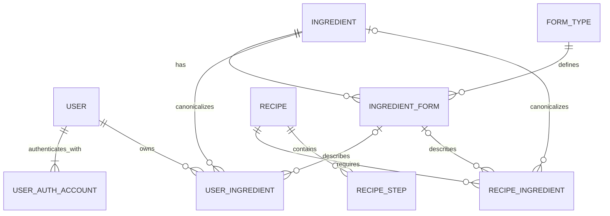

# ERD

WhipUp의 영속 데이터 구조를 정의한다. 비즈니스 의미와 추천 규칙은 `domain.md`를 따르고, 이 문서는 **테이블/관계/제약조건/삭제정책**에 집중한다.

Recommendation 결과는 저장하지 않는다. 현재 User의 보유 재료와 Published Recipe의 필요 재료를 기준으로 조회 시점에 계산한다.

---

# Tables

현재 ERD는 9개 테이블로 구성한다.

```plain text
USER
USER_AUTH_ACCOUNT
INGREDIENT
FORM_TYPE
INGREDIENT_FORM
USER_INGREDIENT
RECIPE
RECIPE_INGREDIENT
RECIPE_STEP
```

## USER

서비스 내부 사용자.

주요 컬럼:

```plain text
user_id PK
```

외부 인증 Provider 식별자는 USER에 직접 저장하지 않는다.

## USER_AUTH_ACCOUNT

외부 인증 계정과 내부 User를 연결한다.

주요 컬럼:

```plain text
auth_account_id PK
user_id FK → USER.user_id
provider
provider_user_id
```

제약조건:

```plain text
UNIQUE(provider, provider_user_id)
```

현재 Provider는 Kakao만 사용하지만 USER 구조를 변경하지 않고 다른 Provider를 추가할 수 있도록 분리한다.

## INGREDIENT

추천 비교에 사용하는 canonical Ingredient Master.

주요 컬럼:

```plain text
ingredient_id PK
canonical_name
```

제약조건:

```plain text
UNIQUE(canonical_name)
```

`마늘`, `양파`, `삼겹살`처럼 가능한 한 순수한 재료만 저장한다. `다진 마늘`, `편마늘`, `대패삼겹살`은 별도 Ingredient가 아니다.

## FORM_TYPE

Ingredient에 독립적인 공통 Form vocabulary.

주요 컬럼:

```plain text
form_type_id PK
code
```

예:

```plain text
WHOLE
BLOCK
SLICE
THIN_SLICE
MINCED
CRUSHED
```

제약조건:

```plain text
UNIQUE(code)
```

## INGREDIENT_FORM

특정 Ingredient에 특정 Form Type이 적용된 실제 형태.

주요 컬럼:

```plain text
ingredient_form_id PK
ingredient_id FK → INGREDIENT.ingredient_id
form_type_id FK → FORM_TYPE.form_type_id
display_name
```

예:

```plain text
마늘 + MINCED = 다진 마늘
마늘 + SLICE = 편마늘
삼겹살 + THIN_SLICE = 대패삼겹살
```

제약조건:

```plain text
UNIQUE(ingredient_id, form_type_id)
```

## USER_INGREDIENT

User가 현재 보유한 재료 상태.

주요 컬럼:

```plain text
user_ingredient_id PK
user_id FK → USER.user_id
ingredient_id FK → INGREDIENT.ingredient_id
ingredient_form_id FK → INGREDIENT_FORM.ingredient_form_id NULL
```

canonical Ingredient는 필수고 Form은 선택이다.

```plain text
삼겹살 보유
→ ingredient_id = 삼겹살
→ ingredient_form_id = NULL

대패삼겹살 보유
→ ingredient_id = 삼겹살
→ ingredient_form_id = 삼겹살 + THIN_SLICE
```

같은 User가 동일 canonical Ingredient의 서로 다른 Form을 동시에 보유할 수 있으므로 `(user_id, ingredient_id)`를 PK나 단순 Unique Key로 사용하지 않는다.

동일한 **user + ingredient + optional form 상태**의 중복은 허용하지 않는다. `NULL`을 포함한 실제 DB Unique Constraint 구현 방식은 Migration 작성 시 PostgreSQL 동작을 고려해 결정한다.

## RECIPE

Draft부터 Published까지 Recipe lifecycle을 관리한다.

주요 컬럼:

```plain text
recipe_id PK
name
status
shorts_reference
```

상태:

```plain text
DRAFT
PUBLISHED
```

Recipe Draft를 별도 테이블로 만들지 않는다.

`shorts_reference`는 YouTube Shorts의 외부 reference이며 별도 SHORTS 테이블은 만들지 않는다.

## RECIPE_INGREDIENT

Recipe의 필요 재료와 실제 조리 표현을 저장한다.

주요 컬럼:

```plain text
recipe_ingredient_id PK
recipe_id FK → RECIPE.recipe_id
ingredient_id FK → INGREDIENT.ingredient_id NULL
ingredient_form_id FK → INGREDIENT_FORM.ingredient_form_id NULL
display_name
raw_text
amount
unit
```

의미:

- `ingredient_id` — 추천 비교에 사용하는 canonical Ingredient
- `ingredient_form_id` — 선택적 Form
- `display_name` — 사용자에게 보여줄 실제 조리 표현
- `raw_text` — 원본에서 추출한 표현
- `amount`, `unit` — 조리 참고용 필요량

Draft에서는 canonical mapping이 완료되지 않을 수 있으므로 `ingredient_id`가 `NULL`일 수 있다.

```plain text
DRAFT → ingredient_id NULL 가능
PUBLISHED → ingredient_id 필수
```

`ingredient_form_id`가 존재한다면 반드시 같은 `ingredient_id`에 속한 Form이어야 한다.

같은 Recipe 안에서 동일 canonical Ingredient가 여러 번 등장할 수 있으므로 다음 Unique Constraint는 두지 않는다.

```plain text
UNIQUE(recipe_id, ingredient_id)  X
```

예:

```plain text
다진 마늘 1큰술 → 마늘 + MINCED
편마늘 5알 → 마늘 + SLICE
```

## RECIPE_STEP

순서가 있는 조리 단계.

주요 컬럼:

```plain text
recipe_step_id PK
recipe_id FK → RECIPE.recipe_id
step_order
content
```

제약조건:

```plain text
UNIQUE(recipe_id, step_order)
```

---

# Relationships



핵심 관계:

```plain text
USER 1:N USER_AUTH_ACCOUNT
USER 1:N USER_INGREDIENT

INGREDIENT 1:N INGREDIENT_FORM
FORM_TYPE 1:N INGREDIENT_FORM

INGREDIENT 1:N USER_INGREDIENT
INGREDIENT_FORM 0..1:N USER_INGREDIENT

RECIPE 1:N RECIPE_INGREDIENT
RECIPE 1:N RECIPE_STEP

INGREDIENT 0..1:N RECIPE_INGREDIENT
INGREDIENT_FORM 0..1:N RECIPE_INGREDIENT
```

`RECIPE_INGREDIENT.ingredient_id`가 optional인 이유는 Draft 상태를 허용하기 때문이다. Published Recipe에서는 application rule로 필수다.

---

# Recommendation Query Model

Recommendation 관련 테이블은 만들지 않는다.

```plain text
User Owned Canonical Ingredients
= DISTINCT USER_INGREDIENT.ingredient_id

Recipe Required Canonical Ingredients
= DISTINCT RECIPE_INGREDIENT.ingredient_id

Missing
= Recipe Required - User Owned

Missing Count
= COUNT(DISTINCT Missing Ingredient)
```

Recommendation에서는 `ingredient_form_id`, `amount`, `unit`을 사용하지 않는다.

같은 User가 `마늘 + MINCED`, `마늘 + SLICE`를 모두 보유해도 추천에서는 `마늘` 하나를 보유한 것으로 본다.

같은 Recipe에 마늘이 여러 Recipe Ingredient로 존재해도 Missing Count에서는 한 번만 계산한다.

---

# Integrity Rules

DB 제약조건과 Application Validation을 함께 사용해 다음 조건을 보장한다.

## Form Consistency

`USER_INGREDIENT.ingredient_form_id`가 존재하면 해당 Form의 `ingredient_id`는 `USER_INGREDIENT.ingredient_id`와 같아야 한다.

`RECIPE_INGREDIENT.ingredient_form_id`가 존재하면 해당 Form의 `ingredient_id`는 `RECIPE_INGREDIENT.ingredient_id`와 같아야 한다.

`RECIPE_INGREDIENT.ingredient_id`가 `NULL`이면 `ingredient_form_id`도 `NULL`이어야 한다.

## Published Recipe

`RECIPE.status = PUBLISHED`이면 application layer에서 다음을 보장한다.

- Recipe name 존재
- Shorts reference 존재
- 하나 이상의 Recipe Ingredient 존재
- 모든 Recipe Ingredient의 `ingredient_id` 존재
- 실제 조리 표현과 필요한 양 존재
- 하나 이상의 Recipe Step 존재
- Recipe Step 순서 유효

Draft의 불완전한 상태를 허용해야 하므로 이 규칙 전체를 단순 `NOT NULL` 제약만으로 표현하지 않는다.

---

# Delete Policy

## USER_INGREDIENT

MVP에서는 Hard Delete한다.

사용자가 보유 재료를 삭제하면 해당 `USER_INGREDIENT` row를 제거한다.

## RECIPE

MVP에서는 Hard Delete한다.

Recipe 삭제 시 연결된 `RECIPE_INGREDIENT`, `RECIPE_STEP`도 함께 제거한다.

삭제된 Recipe는 이후 Recommendation 및 상세 조회 대상이 아니다.

## INGREDIENT

삭제하지 않는다.

Recipe와 User Ingredient가 참조하는 canonical master이므로 MVP 운영에서는 조회/추가/수정만 허용한다.

## FORM_TYPE

삭제하지 않는다.

공통 vocabulary로 관리한다.

## INGREDIENT_FORM

참조 중인 Form은 삭제하지 않는다.

## USER / USER_AUTH_ACCOUNT

회원 탈퇴 요구사항이 현재 MVP에 없으므로 삭제 정책을 아직 정의하지 않는다.

---

# Not Persisted

다음 개념은 테이블로 만들지 않는다.

- Recipe Draft 별도 테이블
- YouTube Shorts 별도 테이블
- Ingredient Master 별도 테이블 (`INGREDIENT` 자체가 Master)
- Recommendation
- Missing Ingredients
- Missing Count
- Recommendation Classification
- Form Compatibility / Conversion
- Ingredient Substitution

Form Compatibility나 Ingredient Substitution이 실제 제품 요구사항이 되면 별도 관계를 추가한다. 현재 ERD에는 미리 넣지 않는다.

---

# Schema Management

ERD는 구조 설계 기준이고 실제 PostgreSQL Schema의 변경 이력은 Flyway Migration으로 관리한다.

```plain text
ERD
 ↓
Flyway Migration
 ↓
PostgreSQL Schema
 ↑
JPA Entity
```

최초 Schema는 `V1__initial_schema.sql`로 생성한다. 실행된 Migration 파일은 수정하지 않고 Schema 변경이 필요하면 새 Migration을 추가한다.
