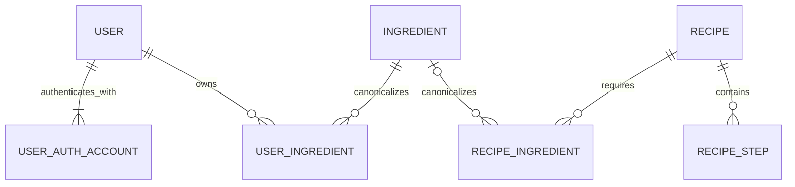

# ERD

WhipUp의 영속 데이터 구조를 정의한다. 비즈니스 의미와 추천 규칙은 `domain.md`를 따르고, 이 문서는 **테이블/관계/제약조건/삭제정책**에 집중한다.

Recommendation 결과는 저장하지 않는다. 현재 User의 보유 재료와 Published Recipe의 필요 재료를 기준으로 조회 시점에 계산한다.

---

# Tables

현재 MVP ERD는 7개 테이블로 구성한다.

```plain text
USER
USER_AUTH_ACCOUNT
INGREDIENT
USER_INGREDIENT
RECIPE
RECIPE_INGREDIENT
RECIPE_STEP
```

Ingredient Form, Category, Alias는 MVP에서 별도 테이블로 만들지 않는다. 실제 조리 표현은 `RECIPE_INGREDIENT.display_name`, `raw_text`에 보존하여 향후 구조화할 수 있도록 한다.

## USER

서비스 내부 사용자.

주요 컬럼:

```plain text
user_id BIGINT IDENTITY PK
created_at TIMESTAMPTZ
updated_at TIMESTAMPTZ
```

외부 인증 Provider 식별자는 USER에 직접 저장하지 않는다.

## USER_AUTH_ACCOUNT

외부 인증 계정과 내부 User를 연결한다.

주요 컬럼:

```plain text
auth_account_id BIGINT IDENTITY PK
user_id FK → USER.user_id
provider
provider_user_id
created_at TIMESTAMPTZ
updated_at TIMESTAMPTZ
```

제약조건:

```plain text
UNIQUE(provider, provider_user_id)
```

현재 Provider는 Kakao만 사용하지만 USER 구조를 변경하지 않고 다른 Provider를 추가할 수 있도록 분리한다.

## INGREDIENT

추천 비교에 사용하는 canonical Ingredient Master.

주요 컬럼:

```plain text
ingredient_id BIGINT IDENTITY PK
canonical_name
created_at TIMESTAMPTZ
updated_at TIMESTAMPTZ
```

제약조건:

```plain text
UNIQUE(canonical_name)
```

`마늘`, `양파`, `삼겹살`처럼 가능한 한 순수한 재료만 저장한다. `다진 마늘`, `편마늘`, `대패삼겹살`은 별도 Ingredient가 아니다.

## Future Ingredient Extension

MVP에서는 Category/Form/Alias 관련 테이블을 생성하지 않는다.

향후 필요성이 확인되면 canonical `INGREDIENT`를 중심으로 다음 구조를 추가할 수 있다.

- `INGREDIENT_FORM`
- `FORM_TYPE`
- `INGREDIENT_CATEGORY`
- `INGREDIENT_CATEGORY_MAPPING`
- Ingredient Alias 관련 구조

기존 Recipe의 실제 표현은 `RECIPE_INGREDIENT.display_name`, `raw_text`에 남아 있으므로 이후 재분석 및 구조화에 사용할 수 있다.

## USER_INGREDIENT

User가 현재 보유한 canonical Ingredient 상태.

주요 컬럼:

```plain text
user_ingredient_id BIGINT IDENTITY PK
user_id FK → USER.user_id
ingredient_id FK → INGREDIENT.ingredient_id
created_at TIMESTAMPTZ
```

MVP에서는 형태를 별도로 저장하지 않는다. 사용자가 실제로 `대패삼겹살`을 가지고 있어도 canonical `삼겹살` 보유로 등록한다.

제약조건:

```plain text
UNIQUE(user_id, ingredient_id)
```

동일 User가 같은 canonical Ingredient를 중복 등록할 수 없다.

## RECIPE

Draft부터 Published까지 Recipe lifecycle을 관리한다.

주요 컬럼:

```plain text
recipe_id BIGINT IDENTITY PK
dataset_key
name
status
shorts_reference
created_at TIMESTAMPTZ
updated_at TIMESTAMPTZ
```

상태:

```plain text
DRAFT
PUBLISHED
```

제약조건:

```plain text
UNIQUE(dataset_key)
```

`dataset_key`는 Repository Dataset과 DB Recipe를 안정적으로 연결하는 식별자이며 User API에 노출하지 않는다.

Recipe Draft를 별도 테이블로 만들지 않는다. MVP 기본 운영 workflow에서는 Draft를 Dataset 파일로 관리하고 검증된 데이터만 `PUBLISHED`로 import하지만, DB는 향후 확장을 위해 `DRAFT` 상태도 표현할 수 있다.

`shorts_reference`는 YouTube Shorts의 외부 reference이며 별도 SHORTS 테이블은 만들지 않는다. Recipe thumbnail은 별도 파일/컬럼으로 관리하지 않고 Shorts reference를 기반으로 가져온다.

## RECIPE_INGREDIENT

Recipe의 필요 재료와 실제 조리 표현을 저장한다.

주요 컬럼:

```plain text
recipe_ingredient_id PK
recipe_id FK → RECIPE.recipe_id
ingredient_id FK → INGREDIENT.ingredient_id NULL
display_name
raw_text
amount NULL
unit NULL
display_order
```

의미:

- `ingredient_id` — 추천 비교에 사용하는 canonical Ingredient
- `display_name` — 사용자에게 보여줄 실제 조리 표현
- `raw_text` — 원본에서 추출한 표현
- `amount`, `unit` — nullable 조리 참고용 필요량
- `display_order` — 사용자에게 표시할 Recipe Ingredient 순서

Draft에서는 canonical mapping이 완료되지 않을 수 있으므로 `ingredient_id`가 `NULL`일 수 있다.

```plain text
DRAFT → ingredient_id NULL 가능
PUBLISHED → ingredient_id 필수
```

제약조건:

```plain text
UNIQUE(recipe_id, display_order)
```

Dataset의 ingredients 배열 순서를 `display_order`로 저장한다.

같은 Recipe 안에서 동일 canonical Ingredient가 여러 번 등장할 수 있으므로 다음 Unique Constraint는 두지 않는다.

```plain text
UNIQUE(recipe_id, ingredient_id)  X
```

예:

```plain text
다진 마늘 1큰술 → 마늘
편마늘 5알 → 마늘
```

## RECIPE_STEP

순서가 있는 조리 단계.

주요 컬럼:

```plain text
recipe_step_id PK
recipe_id FK → RECIPE.recipe_id
step_order
content
```

제약조건:

```plain text
UNIQUE(recipe_id, step_order)
```

---

# Relationships


```mermaid
erDiagram
    USER ||--|{ USER_AUTH_ACCOUNT : authenticates_with
    USER ||--o{ USER_INGREDIENT : owns

    INGREDIENT ||--o{ USER_INGREDIENT : canonicalizes

    RECIPE ||--o{ RECIPE_INGREDIENT : requires
    RECIPE ||--o{ RECIPE_STEP : contains

    INGREDIENT o|--o{ RECIPE_INGREDIENT : canonicalizes
```

핵심 관계:

```plain text
USER 1:N USER_AUTH_ACCOUNT
USER 1:N USER_INGREDIENT

INGREDIENT 1:N USER_INGREDIENT

RECIPE 1:N RECIPE_INGREDIENT
RECIPE 1:N RECIPE_STEP

INGREDIENT 0..1:N RECIPE_INGREDIENT
```

`RECIPE_INGREDIENT.ingredient_id`가 optional인 이유는 Draft 상태를 허용하기 때문이다. Published Recipe에서는 application rule로 필수다.

---

# Recommendation Query Model

Recommendation 관련 테이블은 만들지 않는다.

```plain text
User Owned Canonical Ingredients
= DISTINCT USER_INGREDIENT.ingredient_id

Recipe Required Canonical Ingredients
= DISTINCT RECIPE_INGREDIENT.ingredient_id

Missing
= Recipe Required - User Owned

Missing Count
= COUNT(DISTINCT Missing Ingredient)
```

Recommendation에서는 `amount`, `unit`, 실제 표현/형태를 사용하지 않는다. User의 보유 재료 자체가 canonical Ingredient 단위이므로 동일 canonical Ingredient는 한 번만 보유 상태로 존재한다.

같은 Recipe에 마늘이 여러 Recipe Ingredient로 존재해도 Missing Count에서는 한 번만 계산한다.

---

# Integrity Rules

DB 제약조건과 Application Validation을 함께 사용해 다음 조건을 보장한다.

## Ingredient Consistency

- `USER_INGREDIENT`는 `(user_id, ingredient_id)` 기준으로 중복될 수 없다.
- `PUBLISHED` Recipe의 모든 `RECIPE_INGREDIENT`는 canonical `INGREDIENT`와 연결되어야 한다.
- 실제 표현/형태는 `display_name`, `raw_text`로 보존하며 별도 Form FK를 두지 않는다.

## Published Recipe

`RECIPE.status = PUBLISHED`이면 application layer에서 다음을 보장한다.

- Recipe name 존재
- Shorts reference 존재
- 하나 이상의 Recipe Ingredient 존재
- 모든 Recipe Ingredient의 `ingredient_id` 존재
- 실제 조리 표현 존재
- `amount`, `unit`은 nullable
- Recipe Ingredient `display_order` 유효
- 하나 이상의 Recipe Step 존재
- Recipe Step 순서 유효

Draft의 불완전한 상태를 허용해야 하므로 이 규칙 전체를 단순 `NOT NULL` 제약만으로 표현하지 않는다.

---

# Delete Policy

## USER_INGREDIENT

MVP에서는 Hard Delete한다.

사용자가 보유 재료를 삭제하면 해당 `USER_INGREDIENT` row를 제거한다.

## RECIPE

MVP에서는 Hard Delete한다.

Recipe 삭제 시 연결된 `RECIPE_INGREDIENT`, `RECIPE_STEP`도 함께 제거한다.

삭제된 Recipe는 이후 Recommendation 및 상세 조회 대상이 아니다.

## INGREDIENT

삭제하지 않는다.

Recipe와 User Ingredient가 참조하는 canonical master이므로 MVP 운영에서는 조회/추가/수정만 허용한다.

## USER / USER_AUTH_ACCOUNT

회원 탈퇴 요구사항이 현재 MVP에 없으므로 삭제 정책을 아직 정의하지 않는다.

---

# Not Persisted

다음 개념은 테이블로 만들지 않는다.

- Recipe Draft 별도 테이블
- YouTube Shorts 별도 테이블
- Ingredient Master 별도 테이블 (`INGREDIENT` 자체가 Master)
- Recommendation
- Missing Ingredients
- Missing Count
- Recommendation Classification
- Form Compatibility / Conversion
- Ingredient Substitution

Form Compatibility나 Ingredient Substitution이 실제 제품 요구사항이 되면 별도 관계를 추가한다. 현재 ERD에는 미리 넣지 않는다.

---

# Database Conventions

- PK는 `BIGINT IDENTITY`를 사용한다.
- DB/table/column naming은 `snake_case`를 사용한다.
- Enum 값은 ordinal이 아니라 문자열로 저장한다.
- 시간 컬럼은 PostgreSQL `TIMESTAMPTZ`를 사용하고 기준 instant는 UTC로 저장한다. 사용자 표시가 필요하면 `Asia/Seoul`로 변환한다.
- Ingredient 이름은 import/input 단계에서 trim한 뒤 `canonical_name` DB unique constraint로 중복을 방지한다.
- Recipe name은 중복을 허용하며 Dataset 식별은 `dataset_key`를 사용한다.

# Schema Management

ERD는 구조 설계 기준이고 실제 PostgreSQL Schema의 변경 이력은 Flyway Migration으로 관리한다.

```plain text
ERD
 ↓
Flyway Migration
 ↓
PostgreSQL Schema
 ↑
JPA Entity
```

최초 Schema는 `V1__initial_schema.sql`로 생성한다. 실행된 Migration 파일은 수정하지 않고 Schema 변경이 필요하면 새 Migration을 추가한다.
